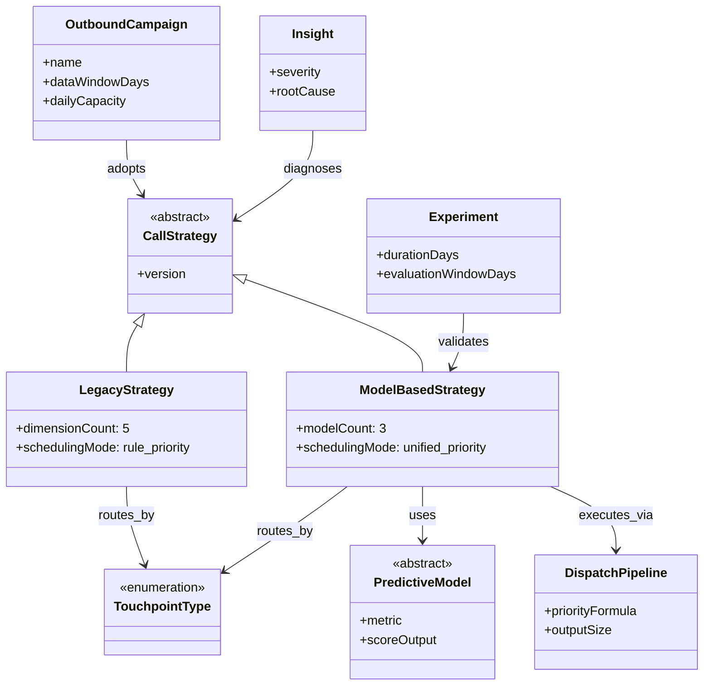
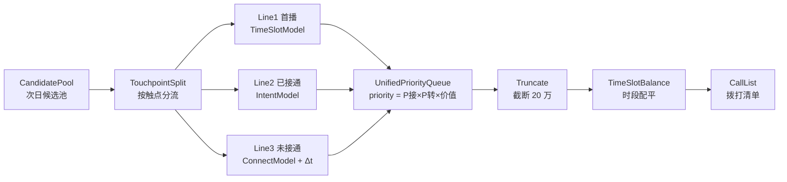

# Pod 拨打策略复盘 · 本体论建模

> 源文档：金条外呼智能拨打策略 · 言犀赛马方案 v2  
> 数据周期：近 35 天真实话单  
> 建模日期：2026-09-02

---

## 1. 建模目标与边界

### 1.1 本轮目标

将《pod拨打策略复盘0902.html》中的业务知识抽象为**可推理、可扩展、可落地**的本体模型，覆盖：

- 现行策略（言犀 5 维硬编码）的结构与缺陷
- 三模型赛马方案（首播 / 已接通复播 / 未接通复播）的实体与关系
- 关键洞察（剩饭、间隔反转、标签泄露）的形式化表达
- 统一调度、停打、实验验证的操作语义

### 1.2 建模边界

| 纳入 | 不纳入 |
|------|--------|
| 策略决策逻辑、触点分类、模型角色 | 具体 SQL / LightGBM 特征工程细节 |
| 指标定义与观测口径 | 用户隐私字段 |
| 实验设计与落地待办 | 坐席人力排班系统 |

---

## 2. 本体架构总览



---

## 3. 类（Classes）定义

### 3.1 顶层域

| 类 | 中文 | 定义 |
|----|------|------|
| `OutboundCampaign` | 外呼战役 | 金条外呼业务单元，含数据窗口、日产能约束 |
| `CallStrategy` | 拨打策略 | 决定谁、何时、是否拨打的决策体系（抽象） |
| `CallRecord` | 话单 | 单次振铃/接通事件，含 before 口径特征 |
| `User` | 用户 | 被外呼对象，关联 life_no 与价值分 |

### 3.2 策略体系

| 类 | 中文 | 定义 |
|----|------|------|
| `LegacyStrategy` | 言犀现行策略 | 5 维硬编码规则，4 条独立管线 |
| `ModelBasedStrategy` | 三模型赛马方案 | 3 模型 + 统一 priority 调度 |
| `DecisionDimension` | 决策维度 | 现行策略的一个独立决策轴 |
| `SchedulingRule` | 调度规则 | 时点批次、间隔阈值、意向分层等 |
| `StopCallRule` | 停打规则 | 放弃拨打的判定条件 |

### 3.3 触点与生命周期

| 类 | 中文 | 定义 |
|----|------|------|
| `TouchpointType` | 触点类型 | 首播 / 已接通复播 / 未接通复播 / 已激活未首贷 |
| `LifecycleStage` | 生命周期 | T0 ~ T10 |
| `DialHistoryState` | 拨打历史态 | 振铃次数、接通次数及其组合 |
| `IntentLabel` | 意向标签 | 高 / 中 / 低 / 无 / 投诉倾向 |

### 3.4 模型层

| 类 | 中文 | 定义 |
|----|------|------|
| `PredictiveModel` | 预测模型 | 抽象基类 |
| `TimeSlotModel` | 时点模型 | 预测首播最优时段，提升 +9.59pp |
| `IntentModel` | 意向模型 | 预测转化概率，AUC ≈ 0.80 |
| `ConnectModel` | 接通模型 | 预测接通概率，AUC ≈ 0.73 |

### 3.5 时间与间隔

| 类 | 中文 | 定义 |
|----|------|------|
| `TimeSlot` | 时段 | 如 09:40-12:29、18:00-18:55 |
| `TimeSlotRole` | 时段角色 | 黄金意向 / 优质 / 尚可 / 兜底剩饭 |
| `RedialRound` | 复拨轮次 | 第 1 ~ 5+ 次未接通复拨 |
| `RedialInterval` | 复拨间隔 | <12h / 12-24h / … / 72h+ |

### 3.6 指标与洞察

| 类 | 中文 | 定义 |
|----|------|------|
| `Metric` | 指标 | 接通率、转化率、AUC、提升 pp 等 |
| `MetricObservation` | 指标观测 | 特定切片下的指标值 |
| `Insight` | 洞察 | 对策略问题的因果解释 |
| `DataQualityIssue` | 数据质量问题 | 如标签泄露 |

### 3.7 调度与实验

| 类 | 中文 | 定义 |
|----|------|------|
| `DispatchPipeline` | 调度流水线 | 候选池 → 分流 → 打分 → 截断 → 配平 → 清单 |
| `CallList` | 拨打清单 | 次日产出，约 20 万条，带时段 |
| `PriorityScore` | 优先级分 | `P(接通) × P(转化) × 用户价值` |
| `Experiment` | 赛马实验 | 实验组 vs 对照组 |
| `ImplementationTask` | 落地待办 | 按优先级排列的工程/策略任务 |

---

## 4. 对象属性（Object Properties）

| 属性 | Domain → Range | 语义 |
|------|----------------|------|
| `adoptsStrategy` | OutboundCampaign → CallStrategy | 战役采用某策略 |
| `hasTouchpoint` | CallRecord → TouchpointType | 话单触点分类 |
| `belongsToUser` | CallRecord → User | 话单归属用户 |
| `occursInTimeSlot` | CallRecord → TimeSlot | 发生在某时段 |
| `atLifecycleStage` | CallRecord → LifecycleStage | 生命周期阶段 |
| `hasDialHistory` | User → DialHistoryState | 用户历史拨打态 |
| `hasIntentLabel` | User → IntentLabel | IVR 意向标签 |
| `routesToPipeline` | TouchpointType → DispatchPipeline | 触点进入对应管线 |
| `usesModel` | ModelBasedStrategy → PredictiveModel | 策略依赖的模型 |
| `appliesToTouchpoint` | PredictiveModel → TouchpointType | 模型服务触点 |
| `hasSchedulingRule` | CallStrategy → SchedulingRule | 策略含调度规则 |
| `hasStopRule` | CallStrategy → StopCallRule | 策略含停打规则 |
| `producesInsight` | CallStrategy → Insight | 策略分析产出洞察 |
| `causedBy` | Insight → SchedulingRule | 洞察根因指向规则 |
| `observedIn` | MetricObservation → Metric | 观测对应指标 |
| `slicedBy` | MetricObservation → TimeSlot / RedialRound / RedialInterval | 指标切片维度 |
| `validates` | Experiment → Insight | 实验验证假设 |
| `comparesStrategy` | Experiment → CallStrategy | 实验对比策略 |
| `outputsCallList` | DispatchPipeline → CallList | 流水线输出清单 |
| `assignedPriority` | CallRecord → PriorityScore | 候选话单优先级 |
| `blockedBy` | CallRecord → StopCallRule | 被停打规则拦截 |

---

## 5. 数据属性（Data Properties）

| 属性 | Domain | 类型 | 示例 |
|------|--------|------|------|
| `dialedBefore` | CallRecord | int | 0, 1, 2… |
| `connBefore` | CallRecord | int | 0, 1… |
| `connectRate` | MetricObservation | float | 0.2747 |
| `convertRate` | MetricObservation | float | 0.00005 |
| `auc` | PredictiveModel | float | 0.80 |
| `liftPp` | MetricObservation | float | +9.59 |
| `sampleCount` | MetricObservation | int | 1277000 |
| `dailyCapacity` | OutboundCampaign | int | 200000 |
| `landingRate` | MetricObservation | float | 0.06 |
| `intentStopThreshold` | StopCallRule | float | 待标定 |
| `priorityScore` | PriorityScore | float | 计算值 |
| `pConnect` | PriorityScore | float | 模型或历史 |
| `pConvert` | PriorityScore | float | 模型或基准 |
| `userValue` | User | float | 价值分 |
| `dataWindowDays` | OutboundCampaign | int | 35 |

---

## 6. 枚举与约束

### 6.1 TouchpointType（触点类型）

```
首播          := dialed_before = 0
已接通复播    := dialed_before ≥ 1 ∧ conn_before ≥ 1
未接通复播    := dialed_before ≥ 1 ∧ conn_before = 0
已激活未首贷  := 独立管线（现行策略）
```

**观测基准（修复泄露后）**

| 触点 | 接通率 | 样本 |
|------|--------|------|
| 首播 | 27.47% | 127.7 万 |
| 已接通复播 | 43.24% | 83.4 万 |
| 未接通复播 | 10.13% | 235.7 万 |

### 6.2 TimeSlotRole（时段角色）

| 时段 | 角色 | 主力任务 |
|------|------|----------|
| 09:40-12:29 | GoldenIntent | 首拨 T0 + 已接通复拨 1/2 |
| 14:00-16:55 | Quality | 首拨 T0 + 已接通复拨 3 |
| 17:00-17:55 | Acceptable | 已接通复拨 4 |
| 18:00-18:55 | LeftoverSink | 未接通复拨 1 |
| 19:00-20:59 | LeftoverSink | 已接通复拨 5/6 + 未接通复拨 2/3 |

### 6.3 RedialInterval × RedialRound 最优策略（未接通复播）

| 轮次 | 最优间隔 | 最优接通率 | 言犀实际 | 判定 |
|------|----------|------------|----------|------|
| 第 1 次 | 48-72h | 17.35% | <12h（1937 万） | 打太急 |
| 第 2 次 | <12h | 10.75% | 48-72h（824 万） | 打太晚 |
| 第 3 次 | <12h | 7.77% | 72h+（747 万） | 打太晚 |
| 第 4 次 | <12h | 6.47% | 72h+（788 万） | 打太晚 |
| 第 5 次+ | 停打 | ~5.2% | 继续打 | 停打区 |

---

## 7. 核心洞察的形式化

### 7.1 Insight: LeftoverScheduling（剩饭编排）

```turtle
:LeftoverScheduling a :Insight ;
    rdfs:label "18点后剩饭洞察"@zh ;
    :severity "critical" ;
    :phenomenon "18/19点转化率仅 0.005–0.007%" ;
    :rootCause "编排把筛剩低质用户排到晚间，非时段本身差" ;
    :causedBy :LegacyEveningFallbackRule ;
    :remedy :UnifiedPriorityScheduling , :IntentStopThreshold .
```

**推理链**

1. 18 点后已接通复拨 5/6 的**圈选条件** ≈ 上午复拨 1/2/3  
2. 但被**排到全天末尾** → 承接顺延的低意向 / 已打未接用户  
3. 因此 `convertRate(18-20h, 已接通复播)` 极低  
4. **结论**：`TimeSlot` 不是因，`SchedulingRule.order` 是因  

### 7.2 Insight: IntervalReversal（间隔反转）

```turtle
:IntervalReversal a :Insight ;
    rdfs:label "未接通复播间隔规律反转"@zh ;
    :rootCause "分层前混淆用户难度与间隔效应" ;
    :ruleForRound1 "wait 48-72h" ;
    :ruleForRound2Plus "redial within 12h same day" .
```

### 7.3 DataQualityIssue: LabelLeakage（标签泄露）

```turtle
:LabelLeakage a :DataQualityIssue ;
    :symptom "已接通复播接通率 100%" ;
    :cause "jtrk/bdrk/xlrk 累计含本通" ;
    :fix :LifeNoWindowBefore ;
    :fixExpression "ROWS BETWEEN UNBOUNDED PRECEDING AND 1 PRECEDING" .
```

---

## 8. 策略对比实例

### 8.1 LegacyStrategy（言犀现行）

```yaml
LegacyStrategy:
  id: yanxi_v_current
  schedulingMode: rule_priority  # 无统一 priority，只有顺序
  dimensions:
    - TouchpointType      # 4 条独立管线
    - LifecycleStage      # T0-T10 分日调度
    - DialHistoryState    # 振 0-8 / 接 0-4 硬阈值
    - IntentLabel         # IVR 高/中/低/无/投诉
    - RedialInterval      # 4/12/36/48/60/96/120/156/168h
  problems:
    - CrossPipelineNoUnifiedScore
    - EveningLeftoverFallback
    - WrongIntervalByRound
```

### 8.2 ModelBasedStrategy（赛马方案 v2）

```yaml
ModelBasedStrategy:
  id: yanxi_horse_race_v2
  schedulingMode: unified_priority
  priorityFormula: "p_connect × p_convert × user_value"
  dailyOutput: 200000
  pipelines:
    - touchpoint: 首播
      keyModel: TimeSlotModel
      winCondition: 上午 9-12 精选时段
      pConvertSource: 历史基准
      stopRule: 一般不停
    - touchpoint: 已接通复播
      keyModel: IntentModel
      winCondition: 攻转化，砍低意向
      pConvertSource: 意向模型直出
      stopRule: INTENT_STOP_THRESHOLD
    - touchpoint: 未接通复播
      keyModel: ConnectModel
      winCondition: 轮次化间隔 + 高轮次停打
      pConvertSource: 历史基准
      stopRule: 第5次+低接通分停打
  techDebt:
    - priority跨线归一化 / 三线产能配额（首播≥40%）
```

---

## 9. 调度流水线本体



**步骤类映射**

| 步骤 | 类 | 输入 | 输出 |
|------|-----|------|------|
| 候选池 | `CandidatePool` | 全量可拨用户 | 未打分候选 |
| 触点分流 | `TouchpointRouter` | 候选 + dialed/conn before | 三线子池 |
| 三线打分 | `PredictiveModel` | 特征向量 | p_connect, p_convert |
| 统一排队 | `PriorityQueue` | priority 分 | 全序 |
| 截断 | `CapacityTruncator` | Top-N | ≤20 万 |
| 时段配平 | `TimeSlotBalancer` | 带分清单 | 分时段清单 |
| 输出 | `CallList` | 最终清单 | 落地拨打 |

---

## 10. 实验本体

```yaml
Experiment:
  id: horse_race_2026_q3
  durationDays: 10
  evaluationWindowDays: 15
  metric: 名转转化率
  treatmentGroup:
    strategy: ModelBasedStrategy
    features:
      - 三线模型调度
      - 第1次等2-3天，第2次起当天追
      - 高轮次/低意向停打
  controlGroup:
    strategy: LegacyStrategy
  explorationTraffic: 0.10
  keyHypothesisTest:
    name: LeftoverScheduling
    slice: "18-20点已接通复播"
    expected: 实验组转化率显著回升
```

---

## 11. 落地待办实例化

| 优先级 | ImplementationTask | 关联类/属性 |
|--------|-------------------|-------------|
| 最高 | priority 跨线归一化 / 三线产能配额 | `PriorityScore`, `DispatchPipeline` |
| 高 | 停打阈值标定 + 概率校准 | `StopCallRule`, `PredictiveModel` |
| 高 | 第 1 次 48-72h 小流量验证 | `RedialInterval`, `Experiment` |
| 高 | 已接通复拨圈选条件全天拉齐 | `SchedulingRule`, `LeftoverScheduling` |
| 中 | 间隔 Δt 进 LightGBM | `ConnectModel`, `dialedBefore` |
| 中 | 分时段概率校准 · power 计算 | `MetricObservation`, `Experiment` |

---

## 12. 推理规则（SWRL 风格，可执行化）

```prolog
% R1: 剩饭判定
evening_leftover(User, TimeSlot) :-
    touchpoint(User, redial_connected),
    time_slot(TimeSlot, role, leftover_sink),
    scheduled_order(User, Order),
    Order > morning_high_intent_cutoff.

% R2: 未接通最优间隔
optimal_interval(redial_round(1), interval(48h, 72h)).
optimal_interval(R, interval(lt, 12h)) :- R >= 2, R =< 4.
should_stop(User) :- redial_round(User, R), R >= 5, p_connect(User, P), P < 0.052.

% R3: 停打低意向已接通
should_stop(User) :-
    touchpoint(User, redial_connected),
    p_convert(User, P),
    P < intent_stop_threshold.

% R4: 统一调度优先级
priority(User, Score) :-
    p_connect(User, Pc),
    p_convert(User, Pv),
    user_value(User, V),
    Score is Pc * Pv * V.
```

---

## 13. 与源文档章节映射

| HTML 章节 | 本体模块 |
|-----------|----------|
| §0 方案摘要 | `ModelBasedStrategy`, KPI `MetricObservation` |
| §1 现行策略解剖 | `LegacyStrategy`, `DecisionDimension` |
| §2 时段编排 & 剩饭 | `TimeSlot`, `TimeSlotRole`, `LeftoverScheduling` |
| §3 数据地基 | `CallRecord`, `LabelLeakage`, `TouchpointType` |
| §4 线1 首播 | `TimeSlotModel`, `MetricObservation` |
| §5 线2 已接通 | `IntentModel`, `StopCallRule` |
| §6 线3 未接通 | `ConnectModel`, `RedialRound`, `RedialInterval` |
| §7 停打框架 | `StopCallRule`, 校准公式 |
| §8 统一调度 | `DispatchPipeline`, `PriorityScore` |
| §9 实验设计 | `Experiment` |
| §10 落地待办 | `ImplementationTask` |

---

## 14. 文件清单

| 文件 | 说明 |
|------|------|
| `2026-09-02_Pod拨打策略_本体建模_v01.md` | 本文档：概念模型 + 关系 + 实例 |
| `2026-09-02_Pod拨打策略_本体_v01.ttl` | OWL/Turtle 形式化本体（可导入 Protégé） |

---

*建模完成。本体将"规则顺序"与"统一 priority"对立、将"时段差"与"剩饭编排"解耦，为策略迭代与实验验证提供共享语义层。*
